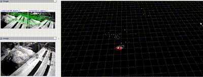
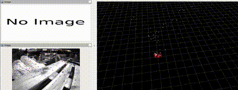

# asr_sdm_video_inertial_navigation_systems

ROS 2 port of [VINS-Mono](https://github.com/HKUST-Aerial-Robotics/VINS-Mono) for ASR-SDM, with an optional SVO-style sparse image-alignment front end.

[English](#english) · [中文](#中文)

---

<a id="english"></a>

## English

### Overview

This stack provides monocular visual–inertial odometry and loop closure. The unified entry point is `vins_estimator/launch/vins_launch.py`, which starts:

`feature_tracker` → `vins_estimator` → `pose_graph` + `rviz2`

| Package | Role |
|---|---|
| `camera_model` | Camodocal camera models |
| `feature_tracker` | Front-end tracking (KLT, optional sparse alignment) |
| `vins_estimator` | Sliding-window VIO + launch entry |
| `pose_graph` | Loop closure / pose graph |
| `config_pkg` | Shared configs, calibration, RViz, support files |
| `benchmark_publisher` | EuRoC ground-truth playback (optional) |
| `ar_demo` | AR demo (optional) |

`config_pkg` exists because ROS 2 `get_package_share_directory()` resolves install-space paths; configs and support files must be installed, not read from `src/`.




### Prerequisites

| Item | Suggested |
|---|---|
| OS | Ubuntu 24.04 |
| ROS 2 | Jazzy |
| OpenCV | 4.x |
| Ceres Solver | 2.x (or system package) |
| Eigen | 3.x |

Older Foxy / Ubuntu 20.04 setups may still build, but this tree is maintained against Jazzy.

### Build

From the workspace root:

```bash
source /opt/ros/jazzy/setup.bash
colcon build --packages-up-to \
  camera_model feature_tracker vins_estimator pose_graph \
  benchmark_publisher ar_demo config_pkg
source install/setup.bash
```

Incremental rebuild after front-end changes:

```bash
colcon build --packages-select feature_tracker
source install/setup.bash
```

### Quick start

Launch config presets live under `vins_estimator/config/`:

| Preset | Sparse (default) | Typical use |
|---|---|---|
| `vins.yaml` | off | EuRoC |
| `vins_d435i.yaml` | on | RealSense D435i |

#### EuRoC

Convert ROS 1 bags to ROS 2 first (e.g. with [rosbags](https://pypi.org/project/rosbags/)). Download datasets from [EuRoC MAV](https://projects.asl.ethz.ch/datasets/doku.php?id=kmavvisualinertialdatasets).

```bash
# Terminal 1
ros2 launch vins_estimator vins_launch.py

# Enable sparse front end for this run
ros2 launch vins_estimator vins_launch.py enable_sparse:=1

# Terminal 2
ros2 bag play /path/to/MH_01_easy
```

#### RealSense D435i

```bash
# Terminal 1
ros2 launch vins_estimator vins_launch.py vins_launch_config:=vins_d435i.yaml

# Terminal 2
ros2 bag play /path/to/your_d435i_bag
```

#### Feature tracker only

```bash
ros2 launch feature_tracker feature_tracker.launch.py
```

### Launch arguments

```bash
ros2 launch vins_estimator vins_launch.py --show-args
```

| Argument | Default | Meaning |
|---|---|---|
| `vins_launch_config` | `vins.yaml` | Launch preset under `vins_estimator/config/` |
| `params_file` | from preset | Runtime params yaml (relative to `config_pkg` unless absolute) |
| `calibration_file` | from preset | OpenCV / camodocal calibration yaml |
| `config_file` | empty | Legacy single OpenCV yaml; overrides `params_file` when set |
| `enable_sparse` | empty | `0` / `1` override; empty = use preset (`enable_sparse` in yaml) |

Examples:

```bash
# Explicit params + calibration
ros2 launch vins_estimator vins_launch.py \
  params_file:=config/euroc/euroc_config.yaml \
  calibration_file:=config/euroc/euroc_cam_calibration.yaml

# Legacy OpenCV single-file config
ros2 launch vins_estimator vins_launch.py \
  config_file:=/path/to/euroc_config_opencv.yaml
```

Edit presets in `vins_estimator/config/*.yaml`, then rebuild `vins_estimator` (or use `--symlink-install`).

### Namespace and topics

Default namespace: `/localization/video_inertial_navigation_systems`

| Topic | Description |
|---|---|
| `.../odometry` | VIO odometry |
| `.../path` | Trajectory path |
| `.../imu_propagate` | IMU-propagated pose |
| `.../feature` | Tracked features |
| `.../sparse_rot` | Sparse-align rotation (when enabled) |

RViz defaults follow this namespace (`config_pkg/config/vins_euroc_rviz.rviz`).

### Camera calibration

`feature_tracker` loads intrinsics / distortion via camodocal.

- Default: `calibration_file` from the launch preset (or `config_file` in legacy mode).
- EuRoC and D435i presets ship matching calibration yaml under `config_pkg/config/`.
- Prefer the launch `calibration_file` argument over hardcoding paths; historical D435i hardcoding mixed datasets and broke EuRoC geometry.

### Sparse front end (SVO-style)

Optional photometric sparse image alignment runs **before** KLT in `feature_tracker` only. The VINS estimator backend is unchanged: it still receives KLT sub-pixel features.

Pipeline:

1. Build / reuse a half-sampled pyramid; optionally use an IMU inter-frame rotation prior.
2. Run Gauss–Newton sparse alignment → `R`, `t`, `chi2`.
3. Adapt KLT `winSize` / `maxLevel` from `chi2` (fallback to 21×21 / 3 levels on failure).
4. KLT start points remain previous-frame pixels; only the search window shrinks.

Key sources:

| File | Change |
|---|---|
| `feature_tracker/src/sparse_img_align.*` | Semi-direct photometric alignment |
| `feature_tracker/src/imu_preintegrate.*` | Lightweight IMU rotation preintegration |
| `feature_tracker/src/feature_tracker.cpp` | Sparse → adaptive KLT order |

Toggle sparse at launch (`enable_sparse:=0/1`) or in the preset / runtime yaml (`use_sparse_align`).

Indicative D435i bag result (slow, textured scene): smaller KLT window/depth with trajectory close to baseline; sparse itself adds ~1 ms/frame, so net win shows mainly under fast motion / low texture.

### Custom datasets

1. Add params + calibration under `config_pkg/config/<dataset>/`.
2. Point `params_file` / `calibration_file` at them (CLI or a new `vins_estimator/config/*.yaml` preset).
3. Rebuild affected packages if install space is not symlinked.
4. Ensure `image_topic`, `imu_topic`, image size, and calibration match the bag.

### Ground truth (EuRoC)

Set `sequence_name` in `benchmark_publisher/launch/benchmark_publisher.launch.py`, rebuild, then:

```bash
ros2 launch vins_estimator vins_launch.py
ros2 launch benchmark_publisher benchmark_publisher.launch.py
ros2 bag play /path/to/MH_01_easy
```

### Acknowledgements

Based on [VINS-Mono](https://github.com/HKUST-Aerial-Robotics/VINS-Mono), [Ceres Solver](http://ceres-solver.org/), [DBoW2](https://github.com/dorian3d/DBoW2), and [camodocal](https://github.com/hengli/camodocal). ROS 2 porting also drew from [VINS-Fusion-ROS2](https://github.com/zinuok/VINS-Fusion-ROS2), [vins-mono-ros2](https://github.com/hitzzq/vins-mono-ros2), and [VINS-MONO-ROS2](https://github.com/dongbo19/VINS-MONO-ROS2).

### License

Released under [GPLv3](https://www.gnu.org/licenses/).

---

<a id="中文"></a>

## 中文

### 概述

本仓库是面向 ASR-SDM 的 [VINS-Mono](https://github.com/HKUST-Aerial-Robotics/VINS-Mono) ROS 2 移植，并可选开启 SVO 风格的稀疏图像对齐前端。

统一入口为 `vins_estimator/launch/vins_launch.py`，会启动：

`feature_tracker` → `vins_estimator` → `pose_graph` + `rviz2`

| 包名 | 职责 |
|---|---|
| `camera_model` | Camodocal 相机模型 |
| `feature_tracker` | 前端跟踪（KLT，可选稀疏对齐） |
| `vins_estimator` | 滑动窗口 VIO + 启动入口 |
| `pose_graph` | 回环 / 位姿图 |
| `config_pkg` | 共享配置、标定、RViz、资源文件 |
| `benchmark_publisher` | EuRoC 真值回放（可选） |
| `ar_demo` | AR 演示（可选） |

ROS 2 的 `get_package_share_directory()` 只能定位到 **install** 目录，因此配置与资源集中放在 `config_pkg` 中安装，而不是直接从 `src/` 读取。


### 依赖

| 项目 | 建议版本 |
|---|---|
| 系统 | Ubuntu 24.04 |
| ROS 2 | Jazzy |
| OpenCV | 4.x |
| Ceres Solver | 2.x（或系统包） |
| Eigen | 3.x |

旧版 Foxy / Ubuntu 20.04 或许可编过，但当前以 Jazzy 为准。

### 编译

在工作空间根目录：

```bash
source /opt/ros/jazzy/setup.bash
colcon build --packages-up-to \
  camera_model feature_tracker vins_estimator pose_graph \
  benchmark_publisher ar_demo config_pkg
source install/setup.bash
```

只改前端时的增量编译：

```bash
colcon build --packages-select feature_tracker
source install/setup.bash
```

### 快速开始

启动预设位于 `vins_estimator/config/`：

| 预设 | 稀疏对齐默认 | 典型用途 |
|---|---|---|
| `vins.yaml` | 关闭 | EuRoC |
| `vins_d435i.yaml` | 开启 | RealSense D435i |

#### EuRoC

请先把 ROS 1 bag 转为 ROS 2（例如 [rosbags](https://pypi.org/project/rosbags/)）。数据集见 [EuRoC MAV](https://projects.asl.ethz.ch/datasets/doku.php?id=kmavvisualinertialdatasets)。

```bash
# 终端 1
ros2 launch vins_estimator vins_launch.py

# 本次运行打开稀疏前端
ros2 launch vins_estimator vins_launch.py enable_sparse:=1

# 终端 2
ros2 bag play /path/to/MH_01_easy
```

#### RealSense D435i

```bash
# 终端 1
ros2 launch vins_estimator vins_launch.py vins_launch_config:=vins_d435i.yaml

# 终端 2
ros2 bag play /path/to/your_d435i_bag
```

#### 仅前端

```bash
ros2 launch feature_tracker feature_tracker.launch.py
```

### 启动参数

```bash
ros2 launch vins_estimator vins_launch.py --show-args
```

| 参数 | 默认 | 含义 |
|---|---|---|
| `vins_launch_config` | `vins.yaml` | `vins_estimator/config/` 下的启动预设 |
| `params_file` | 来自预设 | 运行时参数 yaml（相对 `config_pkg`，或绝对路径） |
| `calibration_file` | 来自预设 | OpenCV / camodocal 标定 yaml |
| `config_file` | 空 | 旧版单文件 OpenCV yaml；非空时覆盖 `params_file` |
| `enable_sparse` | 空 | `0` / `1` 覆盖；空则使用预设里的 `enable_sparse` |

示例：

```bash
# 显式指定参数与标定
ros2 launch vins_estimator vins_launch.py \
  params_file:=config/euroc/euroc_config.yaml \
  calibration_file:=config/euroc/euroc_cam_calibration.yaml

# 旧版 OpenCV 单文件配置
ros2 launch vins_estimator vins_launch.py \
  config_file:=/path/to/euroc_config_opencv.yaml
```

修改 `vins_estimator/config/*.yaml` 后需重新编译 `vins_estimator`（使用 `--symlink-install` 时可直接重开 launch）。

### 命名空间与话题

默认命名空间：`/localization/video_inertial_navigation_systems`

| 话题 | 说明 |
|---|---|
| `.../odometry` | VIO 里程计 |
| `.../path` | 轨迹 |
| `.../imu_propagate` | IMU 递推位姿 |
| `.../feature` | 跟踪特征 |
| `.../sparse_rot` | 稀疏对齐旋转（开启时） |

默认 RViz 配置与该命名空间一致（`config_pkg/config/vins_euroc_rviz.rviz`）。

### 相机标定

`feature_tracker` 通过 camodocal 读取内参与畸变。

- 默认使用启动预设中的 `calibration_file`（旧模式则用 `config_file`）。
- EuRoC / D435i 预设在 `config_pkg/config/` 下有对应标定文件。
- 请用 launch 参数传入标定路径，不要硬编码；历史上写死 D435i 标定会导致 EuRoC 几何错位。

### 稀疏前端（SVO 风格）

可选的光度稀疏图像对齐仅作用于 `feature_tracker`，在 KLT **之前**运行。VINS 后端未改动，仍接收 KLT 亚像素特征。

流程：

1. 构建 / 复用半采样金字塔；可选使用 IMU 帧间旋转先验。
2. Gauss–Newton 稀疏对齐 → `R`、`t`、`chi2`。
3. 按 `chi2` 自适应缩小 KLT 的 `winSize` / `maxLevel`（失败则回退 21×21 / 3 层）。
4. KLT 起点仍为上一帧像素，仅搜索窗变小。

关键源码：

| 文件 | 说明 |
|---|---|
| `feature_tracker/src/sparse_img_align.*` | 半直接光度对齐 |
| `feature_tracker/src/imu_preintegrate.*` | 轻量 IMU 旋转预积分 |
| `feature_tracker/src/feature_tracker.cpp` | 稀疏对齐 → 自适应 KLT |

可通过 `enable_sparse:=0/1`，或在预设 / 运行 yaml 中设置 `use_sparse_align`。

在较慢、纹理丰富的 D435i bag 上：KLT 窗口与金字塔深度下降，轨迹与基线接近；稀疏自身约 +1 ms/帧，净收益更多体现在快速运动或低纹理场景。

### 自定义数据集

1. 在 `config_pkg/config/<dataset>/` 添加参数与标定。
2. 通过 CLI 或新建 `vins_estimator/config/*.yaml` 预设指向这些文件。
3. 若未使用 symlink install，请重新编译相关包。
4. 确认 `image_topic`、`imu_topic`、图像尺寸与标定与 bag 一致。

### 真值对比（EuRoC）

修改 `benchmark_publisher/launch/benchmark_publisher.launch.py` 中的 `sequence_name`，重新编译后：

```bash
ros2 launch vins_estimator vins_launch.py
ros2 launch benchmark_publisher benchmark_publisher.launch.py
ros2 bag play /path/to/MH_01_easy
```

### 致谢

基于 [VINS-Mono](https://github.com/HKUST-Aerial-Robotics/VINS-Mono)、[Ceres Solver](http://ceres-solver.org/)、[DBoW2](https://github.com/dorian3d/DBoW2)、[camodocal](https://github.com/hengli/camodocal)。ROS 2 移植亦参考 [VINS-Fusion-ROS2](https://github.com/zinuok/VINS-Fusion-ROS2)、[vins-mono-ros2](https://github.com/hitzzq/vins-mono-ros2)、[VINS-MONO-ROS2](https://github.com/dongbo19/VINS-MONO-ROS2)。

### 许可证

以 [GPLv3](https://www.gnu.org/licenses/) 发布。
